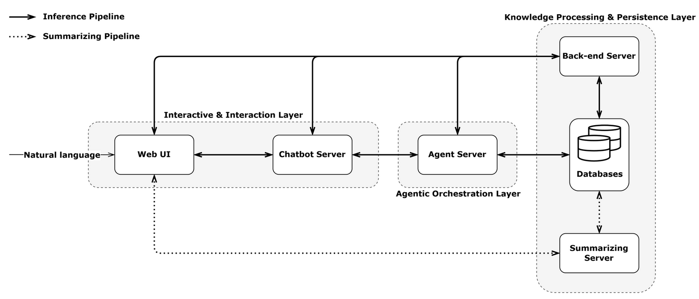
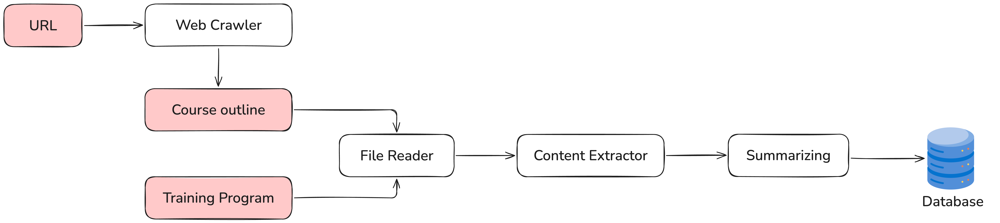
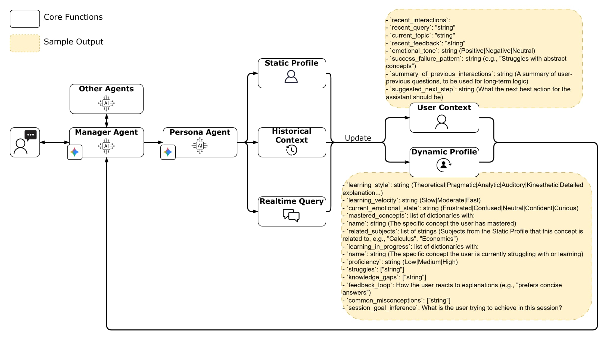

# Personalized AI Assistant

## 1. Motivation

Modern higher education has transitioned from elite, theory-based models to mass education focused on practical application. However, the rapid expansion of knowledge and increasing learner diversity in the 21st century have pushed traditional systems to their limits.

To address these challenges, this project builds upon the foundations of `Intelligent Tutoring Systems (ITS)` by leveraging cutting-edge AI Agents. By implementing role-playing capabilities and personalized personality customization, our system aims to provide a highly adaptive learning experience that meets the unique needs of every modern learner.

The rapid evolution of technology has shifted the educational paradigm from a "one-size-fits-all" approach to a learner-centric model. Traditional adaptive learning systems often rely on rigid, rule-based logic that only adjusts task difficulty. There is a critical need for systems capable of professional-level "reasoning"—analyzing student profiles, planning short-term trajectories, and proactively adjusting content based on goals rather than just reacting to inputs.

`Key Objectives:` This project addresses these challenges by moving beyond simple information retrieval (RAG) toward Personalized AI Agents powered by a Multi-Agent Framework and Large Language Models (LLMs). Our goal is to optimize the learning experience across four core dimensions:
- `Adaptive Pacing:` Allowing learners to progress at their own speed, independent of a collective timeline.
- `Dynamic Learning Paths:` Tailoring topic sequences and depth based on prior knowledge and future career objectives.
- `Contextual Content:` Delivering diverse materials and real-world examples that resonate with the learner's specific interests.
- `Multimodal Instructional Styles:` Dynamically switching between text, diagrams, or practical examples through Persona-based Roleplay to match individual learning styles.

`Key Contributions:` Building upon traditional Intelligent Tutoring Systems (ITS) and leveraging state-of-the-art AI Agent technologies, this project introduces a next-generation educational assistant focused on three core pillars:
- `Agent-Driven Hyper-Personalization:` Moving beyond static data responses, the system implements a multi-agent framework capable of autonomous planning and dynamic path adjustment tailored to each learner's unique objectives.
- `Immersive Role-Playing & Mentorship:` By utilizing advanced Persona Engineering, the AI transcends basic knowledge delivery. It functions as a specialized mentor, adopting specific teaching styles and personalities that resonate with the learner's psychological profile.
- `Context-Aware Knowledge Integration:` The architecture seamlessly integrates RAG (Retrieval-Augmented Generation) with autonomous agents. This ensures that the assistant provides accurate, up-to-date educational content while maintaining deep contextual relevance for every individual interaction.

## 2. Overview

The system architecture of the Personalized AI Assistant is designed according to the microservices model to ensure flexibility, scalability, and clear separation of the functions of each component. This architecture is divided into two main pipelines: the summarizing pipeline (knowledge preparation) and the inference pipeline (real-time interaction), with many constituent services.

<p align="center">
  
</p>

### 2.1. Summarizing Pipeline

In a Personalized Educational AI Assistive system, this server is responsible for processing and condensing raw data into standardized knowledge segments, which are used to build contextual profiles.

Contextual profiles are divided into three types:
- `Static Profile:` includes courses taken, grades, and course summaries.
- `Dynamic Profile:` created from the Static Profile and updated each time the student provides feedback. It includes knowledge acquired, level of understanding, difficulties encountered, and learning style.
- `User Context:` includes eecent queries, user feedback, emotional tone, success or failure of previous explanations.

<p align="center">
  
</p>

### 2.2. Inference Pipeline

An Inference Pipeline is a series of real-time data processing steps. Unlike a Summarizing Pipeline, an Inference Pipeline focuses on analyzing user requirements, combining them with learning history, and then assigning them to the appropriate sub-agent and responding to the user.

`Manager Agent` is the central agent, acting as the strategic decision-maker and coordinating the workflow among sub-agents.

`Persona Agent` is the "heart" of the system, where inference is performed and the contextual profile of each user is maintained.

<p align="center">
  
</p>

## 3. Deployment

### 3.1. Setup .env

- Update file `.env` with your own data:

    ````bash
    MODEL_ID = "gemini-2.5-flash"

    GOOGLE_GENAI_USE_VERTEXAI = FALSE
    GOOGLE_API_KEY = "<YOUR_GEMINI_API>"

    POSTGRES_HOST = "postgres_db"
    POSTGRES_PORT = "5432"
    POSTGRES_USER = "admin"
    POSTGRES_PASSWORD = "123456"
    POSTGRES_DB = "db"

    AGENT_SERVER_HOST = "agent-server"
    AGENT_SERVER_PORT = "8000"

    INGESTOR_SERVER_HOST = "ingestor"
    INGESTOR_SERVER_PORT = "8001"

    BE_SERVER_HOST = "back-end"
    BE_SERVER_PORT = "8002"

    CHATBOT_SERVER_HOST = "chatbot-server"
    CHATBOT_SERVER_PORT = "8003"

    EVALUATION_MODEL_ID = "gpt-4o"
    EVALUATION_API_KEY = "<YOUR_OPENAI_KEY>"

    ENABLE_PERSONA = "true"
    ````

### 3.2. Build Docker images

- Build containers:

    ```bash
    sudo docker-compose up --build -d
    sudo docker ps
    ```

- Check logs:
 
    ```bash
    sudo docker logs <container_name>
    ```

### 3.3. APIs

- `Ingestor Server:` See details at [Ingester Server APIs](ingestor/INGESTOR_APIS.md)

- `Back-end Server:` See details at [Back-end Server APIs](back_end/BACKEND_APIS.md)

- `Chatbot Server:` See details at [Chatbot Server APIs](chatbot/servers/chatbot_server/CHATBOT_APIS.md)

- `Evaluation:` See details at [Evaluation APIs](chatbot/servers/chatbot_server/EVALUATION.md)
